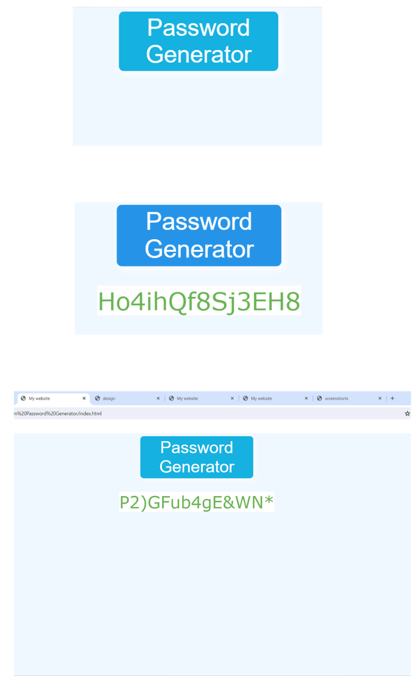
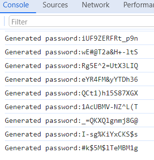

 # Random password generator 🔑
 
 <br>

 ## Javascript Code

 ```// Random Password Generator
function generatePassword(length, includeLowercase, includeUppercase, includeNumbers, includeSymbols) {
    const lowercaseChars = "abcdefghijklmnopqrstuvwxyz";
    const uppercaseChars = "ABCDEFGHIJKLMNOPQRSTUVWXYZ";
    const numberChars = "0123456789";
    const symbolChars = "!@#$%^&*()_+-=";
    let allowedChars = "";
    let password = "";
    allowedChars += includeLowercase ? lowercaseChars : "";
    allowedChars += includeUppercase ? uppercaseChars : "";
    allowedChars += includeNumbers ? numberChars : "";
    allowedChars += includeSymbols ? symbolChars : "";
    if (length <= 0) {
        return `password length must at least 1`;
    }
    if (allowedChars.length === 0) {
        return `At least 1 set of character needs to be selected`;
    }
    for(let i = 0; i < length; i++){
        const randomIndex=Math.floor(Math.random()*allowedChars.length);
        password+=allowedChars[randomIndex]
    }
    return password;
}
const passwordlength = 14;
const includeLowercase = true;
const includeUppercase = true;
const includeNumbers = true;
const includeSymbols = true;

const password = generatePassword(passwordlength, includeLowercase, includeUppercase, includeNumbers, includeSymbols)
console.log(`Generated password:${password}`);
```
### Formula
```     const randomIndex=Math.floor(Math.random()*allowedChars.length);              password+=allowedChars[randomIndex];```

##### Console
